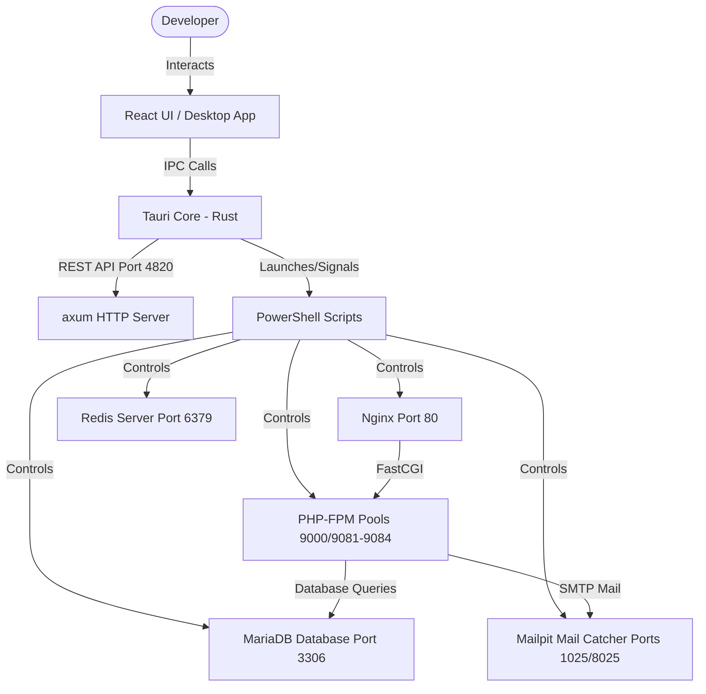

# ⚡ ElectroStack

<div align="center">

```text
    ______              __             _____ __             __
   / ____/___  ______  / /__________  / ___// /_____ ______/ /__
  / __/ / __ \/ ___/ _  __/ ___/ __ \ \__ \/ __/ __ `/ ___/ //_/
 / /___/ /_/ / /__/  / /_/ /  / /_/ /___/ / /_/ /_/ / /__/ ,<
/_____/\____/\___/   \__/_/   \____//____/\__/\__,_/\___/_/|_|
```

**A Modern, Lightweight, Fast, and Extensible Local Web Development Server Suite for Windows.**

[](https://github.com/electrostack/electrostack)
[](https://github.com/electrostack/electrostack)
[](https://github.com/electrostack/electrostack)
[](https://github.com/electrostack/electrostack)

<p align="center">
  <a href="#key-features">Key Features</a> •
  <a href="#architecture">Architecture</a> •
  <a href="#quick-start">Quick Start</a> •
  <a href="#roadmap">Roadmap</a>
</p>

</div>

---

## 🚀 Key Features

*   **⚡ Tauri-powered Desktop UI:** Extremely lightweight, native Windows executable using Rust for core services and React for the administration interface.
*   **🌐 Nginx Web Server:** High-performance web serving with pre-configured HTTP/2, local domain routing (`*.local`), and folder aliases.
*   **🐘 Multi-Version PHP-FPM:** Easily run PHP 8.1, 8.2, 8.3, or 8.4 globally or isolated per website.
*   **🦫 MariaDB Database:** Bundled database server with phpMyAdmin integrated out-of-the-box, supporting password-less autologin for developers.
*   **🎈 Redis Caching:** Built-in Redis server with live telemetry memory utilization metrics on the dashboard.
*   **📬 Mail Catcher (Mailpit):** Intercepts outbound SMTP emails and displays them in a gorgeous local inbox layout.
*   **🔒 System-trusted SSL:** Generate trusted self-signed SSL certificates in one click and register them globally with the Windows Trust Store.
*   **🚀 Application Boilerplate Templates:** Spawn pre-configured WordPress, Laravel, or React/Vite web projects in seconds.
*   **🚇 Local Tunnels (Ngrok):** Instantly share local sites with clients using secure tunnels.
*   **🛠️ Developer Tooling:** Native access to Composer, Node.js/npm, Git controls, real-time log viewers, and system tray quick menus.

---

## 📐 Architecture

ElectroStack maps a secure, authenticated communications bridge between a native desktop shell (Tauri/Rust) and local system services:



---

## ⚡ Quick Start

### Prerequisites
*   Windows 10 or 11 (64-bit)
*   PowerShell 5.1+ (runs with Administrator elevation during initial provisioning)

### Installation
1.  Download the latest installer `ElectroStackSetup.exe` from the [Releases](https://github.com/electrostack/electrostack/releases) tab.
2.  Run the setup program. This installs the suite to `C:\ElectroStack\`.
3.  Launch the **ElectroStack** application from your Desktop or Start Menu.
4.  Click **Initialize** in the top action bar to run the system layout repair and download/configure service runtimes.
5.  Press **Start All** to spin up Nginx, PHP, MariaDB, Redis, and Mailpit.
6.  Open **`http://localhost/phpmyadmin/`** to manage databases or **`http://localhost/trading/`** to view the built-in server status dashboard.

---

## 🗺️ Roadmap & Ecosystem

- [x] Tauri v2 desktop shell with tray minimizer.
- [x] Fast, secure API REST bridge with bearer authentication.
- [x] Auto-login phpMyAdmin config authentication.
- [x] Direct PowerShell launcher for layout repairs.
- [ ] Single-click root certificate system trust mapping.
- [ ] Isolated multi-pool PHP-FPM execution.
- [ ] Mailpit SMTP server bundling.
- [ ] WordPress, Laravel, and React project installers.
- [ ] Ngrok local tunnel dashboard widget.
- [ ] Taskbar tray quick actions context menu.

---

## 📄 License

This project is open-source software licensed under the [MIT License](LICENSE).
