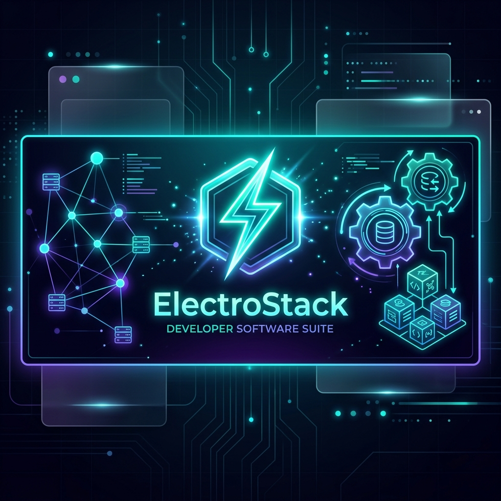

# ⚡ ElectroStack

<p align="center">
  
</p>

<div align="center">

**A Premium, High-Performance, and Extensible Local Web Development Server Suite for Windows.**

[](https://github.com/manoranjan2050/ElectroStack)
[](https://github.com/manoranjan2050/ElectroStack)
[](https://github.com/manoranjan2050/ElectroStack)
[](https://github.com/manoranjan2050/ElectroStack)
[](LICENSE)

<p align="center">
  <a href="#-key-features">Key Features</a> •
  <a href="#-system-architecture">Architecture</a> •
  <a href="#-quick-start">Quick Start</a> •
  <a href="#-dashboard-telemetry">Dashboard & Gauges</a> •
  <a href="#-docker-orchestration">Docker Management</a> •
  <a href="#-remote-deployment">SSH Git Deployment</a>
</p>

</div>

---

## 🚀 Key Features

*   **⚡ Tauri-Powered Desktop Shell:** Built with a high-performance Rust core and an elegant, responsive React frontend. Includes taskbar tray integration with quick-action shortcuts.
*   **📈 Animated Telemetry Dials:** Live circular gauge cards and historical sparkline graphs mapping CPU, RAM, and Disk space in real-time.
*   **🐳 Docker Orchestration Hub:** Manage containers, pull tags, spin up custom containers with port mapping, and prune resources directly from the dashboard.
*   **🌍 Nginx Web Server:** High-speed local Nginx server pre-configured with HTTP/2 and auto-dns `.local` host mapping on site creation.
*   **🐘 Isolated PHP-FPM Pools:** Switch PHP versions (8.1, 8.2, 8.3, or 8.4) globally or bind them independently per website on dedicated ports.
*   **🦫 MariaDB & Auto-phpMyAdmin:** Autologin dev database integration, with one-click backups and SQL restore mappings.
*   **📬 SMTP Mail Catcher (Mailpit):** Capture all outbound application emails and inspect them in an inline local inbox widget.
*   **🔒 Trusted SSL Certificates:** Generate and automatically register self-signed SSL root certificates globally in the Windows Trust Store.
*   **📂 PortaGit Station:** In-app Git switcher, heatmaps of your commits, and an interactive side-by-side visual diff tool.
*   **🚀 Remote Git Deployment Engine:** Secure one-click SSH deployment engine that configures Windows OpenSSH key permissions and automates remote server git-pull / build scripts.

---

## 📐 System Architecture

ElectroStack communicates over a secure, authenticated REST bridge and direct system hooks:


---

## 📊 Dashboard Telemetry

The dashboard displays high-tech gauge cards for system resource telemetry:
*   **Real-time CPU Delta Calculation:** Instantiated via a thread-safe global `Mutex` system instance to record actual CPU processor consumption values.
*   **Circular Progress Rings:** SVG-driven gauges that dynamically animate metrics using cubic-bezier timing functions.
*   **Sparklines:** Historical SVG graphs indicating fluctuations of resources over the past 20 ticks.

---

## 🐳 Docker Orchestration

Manage local containers and image layers without command-line overhead:
*   **Container Controller:** Start, stop, restart, and retrieve real-time console logs from running containers.
*   **Image Registries:** Pull images by tags, display sizes, and prune unused layers in one click.
*   **Container Creator:** Instantly map host/container ports and spin up sandboxed environments.

---

## 🛫 Remote Deployment

Automate project production builds using the integrated SSH Git Deployment Engine:
*   **Windows OpenSSH Bridge:** Launches native `ssh.exe` directly on Windows with strict host key checking bypassed.
*   **Secure Key Handshake:** Generates temporary key files and invokes a PowerShell ACL script to lock file access down exclusively to the active Windows user account, avoiding private key permission warnings.
*   **Build Sequence Checklist:** Define custom deployment sequences (e.g. `git pull`, `composer install`, `npm run build`) that execute chronologically. If any step fails, execution halts safely.

---

## ⚡ Quick Start

### Prerequisites
*   Windows 10 or 11 (64-bit)
*   PowerShell 5.1+ (runs with Administrator elevation during initial provisioning)

### Installation & Run
1.  Clone the repository:
    ```bash
    git clone https://github.com/manoranjan2050/ElectroStack.git
    cd ElectroStack
    ```
2.  Install dependencies and build assets:
    ```bash
    npm install
    npm run build
    ```
3.  Launch the Tauri desktop app:
    ```bash
    npm run tauri dev
    ```
4.  Click **Initialize** inside the application dashboard to provision the directories, MariaDB, Nginx, and PHP binaries.

---

## 📄 License

Distributed under the MIT License. See [LICENSE](LICENSE) for more information.
